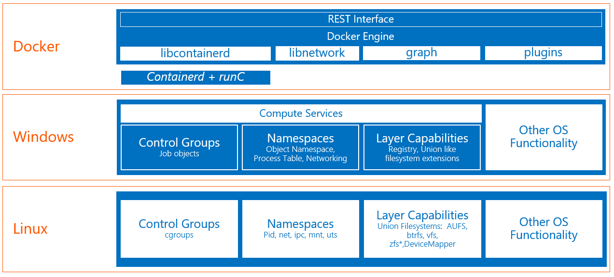
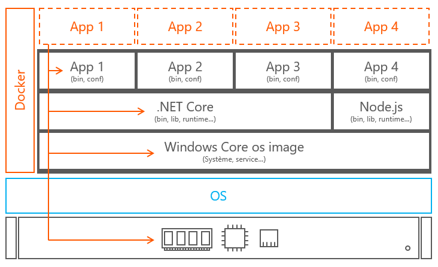
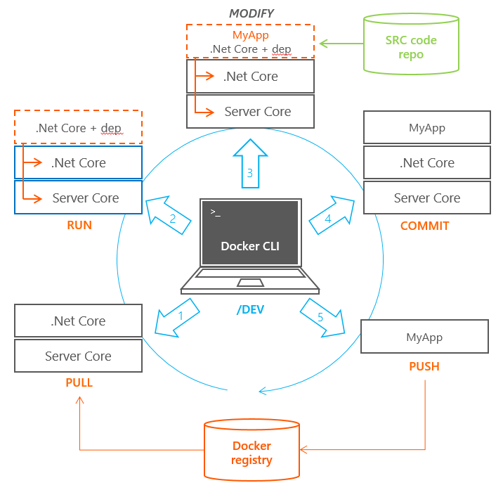
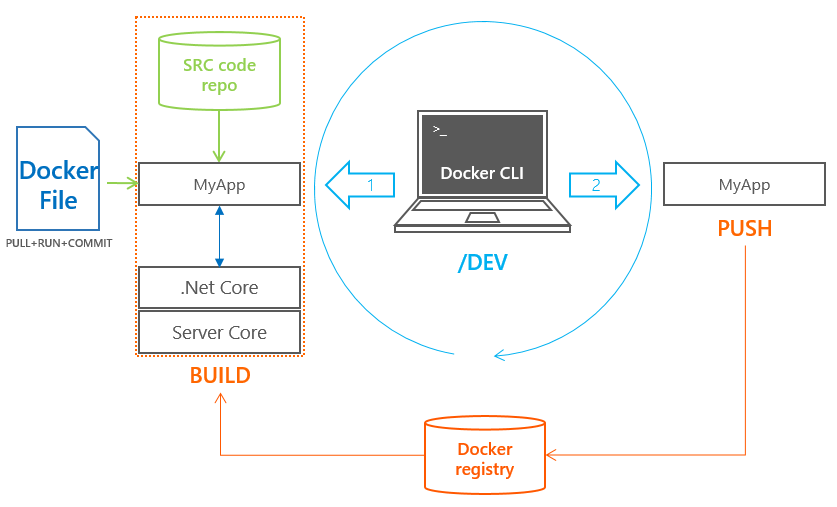
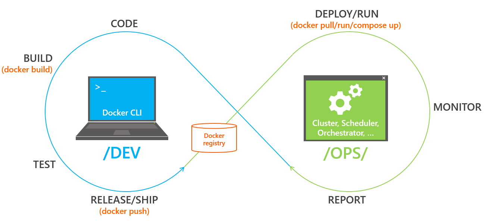

# Docker Container Deepdive

Labs and quick introduction for a "Docker container deep" session

## Terminologie

### Docker engine
Instrument OS virtualization capabilities to execute processes in isolation

### Docker CLI
Command line client for Docker engine built in the same binary

### Docker images
Immutable and portable "package" containing a service and its dependencies (binaries and librairies)

### Container
Instantiation of a container image at runtime in an isolated and non persistent fashion

### Docker Registry
Storage service to publish and distribute container images organized in repositories

## Container what ?

### **Containers are not**
Objects
Virtual machines (even light ones!!!)
Virtualized App (like App-V or ThinApp)

### **Containers are** (among other things)
Os virtualization
Process executed in an isolated way
Non persistent execution
Dedicated view over a file system, a process tree, a network stack..
Measurable and sizeable access to compute resources
Lighter storage and compute footprint
Direct access to hardware resources
Common artefacts for dev and ops

## Architecture



## Container layers



## Manual build



## Automated build (based on DockerFile)



```
FROM microsoft/iis

MAINTAINER John McLane

LABEL Description="Ninja cat rules on IIS (frontend)“

ENV myName="John McLane"

RUN mkdir C:\ninjacat \
  && powershell -NoProfile -Command \
      Import-module IISAdministration; \
      New-IISSite -Name "Site" -PhysicalPath C:\ninjacat -BindingInformation "*:8080:"

RUN powershell wget https://raw.githubusercontent.com/johnmclane/demo/master/src/index.html -outfile C:\ninjacat\index.htm

EXPOSE 8080

ENTRYPOINT ["C:\\ServiceMonitor.exe", "w3svc"]
```

## Lifecycle


